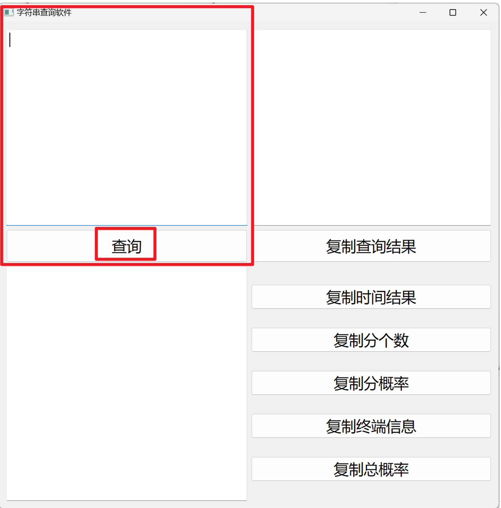
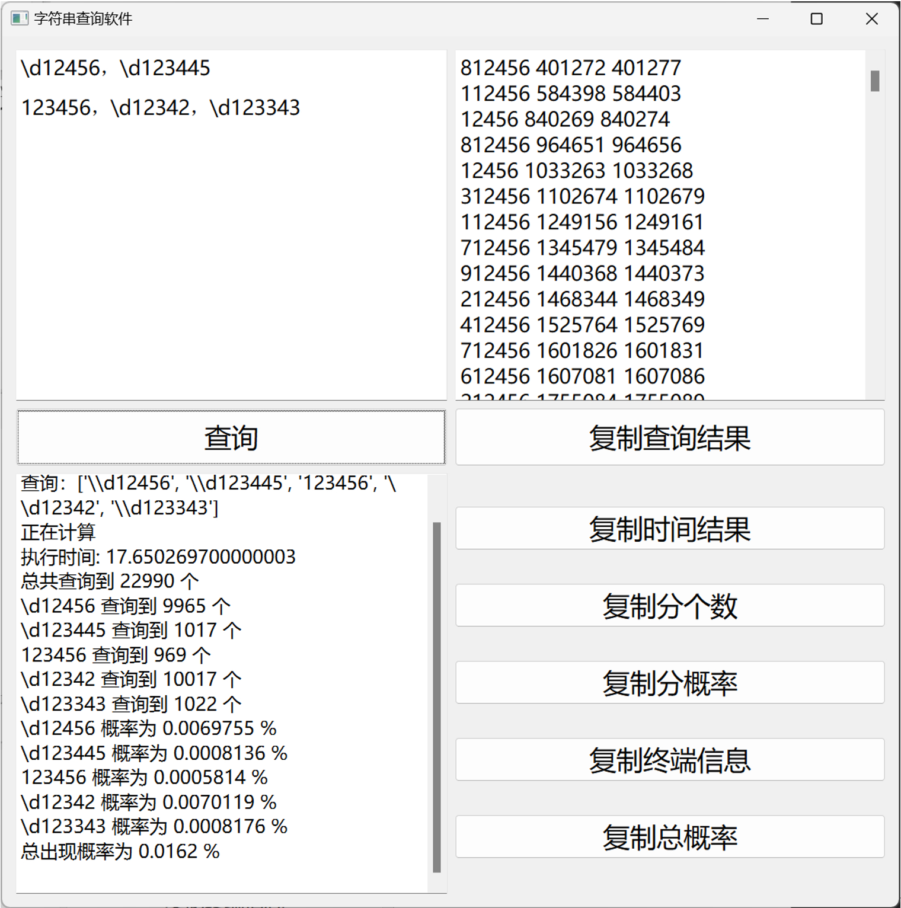

# str-search-GUI

字符串查询软件说明
把数据放入同级 Data 文件夹
这里输入查询信息：

这样输入，中文或者英文的逗号、回车均被视为分隔符，已经做去空格处理：

1

1，2
11，123，123
支持正则表达式：
\d12456，\d123445
123456，\d12342，\d123343
结果如下：
结果显示的是：查询量，开始序列，结束序列

这个概率在正则计算时是有问题的，暂时想不出较好的计算方法
